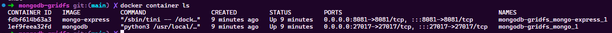
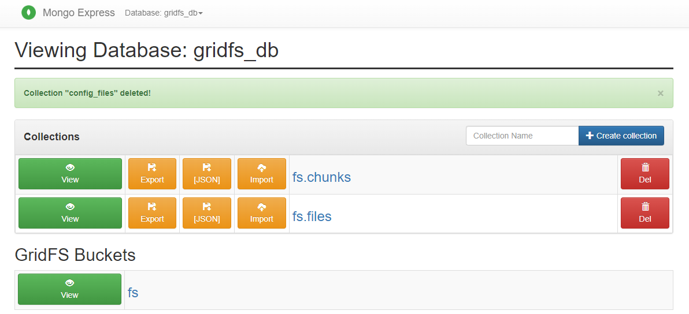

# Storing files with Mongodb GridFS

## Starting Docker Containers

Open a new terminal window at this folder an run:

* `make start` to run the containers  
* `make stop` to stop the containers

## Inserting files into DB

1. Open a new terminal window at this folder an run `docker container ls` to list the running containers;  

2. Copy the mongodb image CONTAINER_ID then run `docker exec -it <CONTAINER_ID> bash mongofiles.sh`

## Viewing files in DB

1. Open a new browser window and navigate to http://localhost:8081/  
2. Select the **gridfs_db** and click on **View** button
3. The files can be found in **fs.files** and **fs.chunks** collections

